# SkillBridge 🚀

**Merit-first student talent discovery for local businesses.**

SkillBridge connects students from Tier-2 and Tier-3 colleges with MSMEs through reviewer-verified skills, practical assignments, auditable TrustScore, and real project delivery. Hiring decisions are based on demonstrated work rather than college brand or an inflated resume.

## 🔗 Live Demo

[https://skillbridge.debarghya.org](https://skillbridge.debarghya.org) 👈

## 💡 Problem and Approach

Capable students often lack access to credible work, while local businesses struggle to find affordable, evidence-backed talent. SkillBridge closes both gaps with one end-to-end workflow:

1. Students build a portfolio and submit evidence to verify their skills.
2. Platform reviewers assess the evidence with a structured rubric.
3. Companies discover candidates through verified skills, TrustScore, and practical interview tasks.
4. Selected students complete work in a shared project pipeline.
5. Companies approve delivery and record the payment made outside SkillBridge.

## ✨ Product Capabilities

| Experience | What is implemented |
| --- | --- |
| **🎓 Student** | Profile and portfolio, GIG discovery, saved/applied/active work, direct invites, interview assignments, Skill Hub, TrustScore, peer network, Team-Up, and earnings history. |
| **🏢 Company** | Business profile, GIG publishing, applicant pipeline, talent search, direct opportunities, task library, submission review, project workspace, and external payment records. |
| **🧑‍⚖️ Reviewer** | Protected reviewer access, blind assessment queue, claim ownership, scoring rubric, revision requests, approval/rejection, and review history. |
| **📈 Merit layer** | Verified skill stages, renewal and retention, approved-activity streaks, skill-gap analysis, event-ledger TrustScore, and public evidence-backed profiles. |

### 🛡️ Core Guarantees

- Unreviewed profile content does not award TrustScore.
- Reviewer approval is required before a skill becomes verified or upgraded.
- Duplicate assessment, payment, and TrustScore events are guarded at the database and service layers.
- SkillBridge records externally completed payments; it does not hold funds, provide escrow, or offer withdrawals.

## 🏗️ Architecture

### 1. 🧱 3-Tier Client-Server Architecture

```text
┌──────────────────────────────────────────────────────────────────────────┐
│                         1. PRESENTATION TIER                             │
│                         React + Vite Client                              │
│                                                                          │
│  Public Experience        Student Workspace         Company Workspace    │
│  - Landing and login      - Profile and portfolio  - Business profile    │
│  - Public profiles        - GIG Center             - GIG Management      │
│                           - Skill Hub and tasks     - Talent Search      │
│  Reviewer Portal          - TrustScore             - Project Workspace   │
│  - Blind review queue     - Network and Team-Up    - External Payments   │
│  - Rubric and decisions   - Earnings                                     │
└────────────────────────────────────┬─────────────────────────────────────┘
                                     │
                                     │ HTTPS / JSON API
                                     ▼
┌──────────────────────────────────────────────────────────────────────────┐
│                          2. APPLICATION TIER                             │
│                       Node.js Native HTTP Server                         │
│                                                                          │
│  Request Pipeline                         Domain Services                │
│  - Routing and JSON parsing               - Student and Company          │
│  - Session authentication                 - GIG and Interview Tasks      │
│  - Student, Company and Reviewer roles    - Skill Assessments            │
│  - CORS and rate limiting                 - Blind Reviewer Queue         │
│  - Payload and ownership validation       - TrustScore Policy Engine     │
│  - Conflict and error handling            - Network and Team-Up          │
│                                           - Workspace and Payments       │
└────────────────────────────────────┬─────────────────────────────────────┘
                                     │
                                     │ Mongoose ODM
                                     ▼
┌──────────────────────────────────────────────────────────────────────────┐
│                             3. DATA TIER                                 │
│                            MongoDB Database                              │
│                                                                          │
│  Core Accounts            Evidence and Work        Community and Metrics │
│  - Students               - SkillAssessments       - NetworkConnections  │
│  - Companies              - TaskSubmissions        - TeamPosts           │
│  - Reviewers              - Review history         - SiteMetrics         │
│  - Role sessions          - External payment data                        │
│                                                                          │
│  Embedded account state: profiles, Skill Hub activity, TrustScore ledger,│
│  GIG state, company task library and project workspace                   │
│  Payment and earnings history is derived from completed TaskSubmissions  │
└──────────────────────────────────────────────────────────────────────────┘
```

> ⚡ **Quick flow:** React interface → secured Node.js API → Mongoose models → MongoDB persistence.

### 2. 🔄 System Architecture & Workflow Diagram

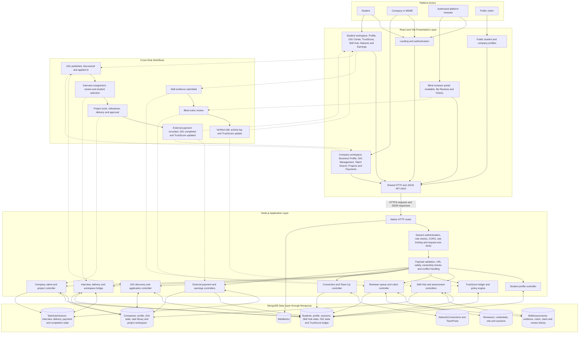
```mermaid
flowchart TB
    subgraph Actors[Platform Actors]
        Student[Student]
        Company[Company or MSME]
        Reviewer[Authorized platform reviewer]
        Visitor[Public visitor]
    end

    subgraph Client[React and Vite Presentation Layer]
        Landing[Landing and authentication]
        StudentUI[Student workspace: Profile, GIG Center, TrustScore, Skill Hub, Network and Earnings]
        CompanyUI[Company workspace: Business Profile, GIG Management, Talent Search, Projects and Payments]
        ReviewerUI[Blind reviewer portal: Available, My Reviews and History]
        PublicUI[Public student and company profiles]
        ApiClient[Shared HTTP and JSON API client]

        Landing --> ApiClient
        StudentUI --> ApiClient
        CompanyUI --> ApiClient
        ReviewerUI --> ApiClient
        PublicUI --> ApiClient
    end

    Student --> Landing
    Student --> StudentUI
    Company --> Landing
    Company --> CompanyUI
    Reviewer --> Landing
    Reviewer --> ReviewerUI
    Visitor --> PublicUI

    subgraph Backend[Node.js Application Layer]
        Router[Native HTTP router]
        Security[Session authentication, role checks, CORS, rate limiting and request-size limits]
        Validation[Payload validation, URL safety, ownership checks and conflict handling]

        StudentController[Student profile controller]
        SkillController[Skill Hub and assessment controllers]
        ReviewerController[Reviewer queue and rubric controller]
        TrustController[TrustScore ledger and policy engine]
        GigController[GIG discovery and application controller]
        TaskController[Interview, delivery and workspace bridge]
        CompanyController[Company, talent and project controller]
        NetworkController[Connection and Team-Up controller]
        PaymentController[External payment and earnings controllers]

        Router --> Security --> Validation
        Validation --> StudentController
        Validation --> SkillController
        Validation --> ReviewerController
        Validation --> TrustController
        Validation --> GigController
        Validation --> TaskController
        Validation --> CompanyController
        Validation --> NetworkController
        Validation --> PaymentController
    end

    ApiClient -->|HTTPS requests and JSON responses| Router

    subgraph Database[MongoDB Data Layer through Mongoose]
        Students[(Students: profile, sessions, Skill Hub state, GIG state and TrustScore ledger)]
        Companies[(Companies: profile, GIG state, task library and project workspace)]
        Reviewers[(Reviewers: credentials, role and sessions)]
        Assessments[(SkillAssessments: evidence, rubric, claim and review history)]
        Submissions[(TaskSubmissions: interview, delivery, payment and completion state)]
        Connections[(NetworkConnections and TeamPosts)]
        Metrics[(SiteMetrics)]
    end

    StudentController <--> Students
    SkillController <--> Students
    SkillController <--> Assessments
    SkillController --> Companies
    ReviewerController <--> Reviewers
    ReviewerController <--> Assessments
    ReviewerController --> Students
    TrustController <--> Students
    GigController <--> Students
    GigController <--> Companies
    TaskController <--> Submissions
    TaskController <--> Students
    TaskController <--> Companies
    CompanyController <--> Companies
    CompanyController --> Students
    CompanyController --> Submissions
    NetworkController <--> Connections
    NetworkController --> Students
    PaymentController <--> Submissions
    PaymentController --> Students
    PaymentController --> Companies
    Router --> Metrics

    subgraph Workflows[Cross-Role Workflows]
        SkillFlow[Skill evidence submitted]
        BlindReview[Blind rubric review]
        SkillResult[Verified skill, activity log and TrustScore update]
        GigFlow[GIG published, discovered and applied to]
        InterviewFlow[Interview assignment, review and student selection]
        WorkFlow[Project work, milestones, delivery and approval]
        PayFlow[External payment recorded, GIG completed and TrustScore updated]

        SkillFlow --> BlindReview --> SkillResult
        GigFlow --> InterviewFlow --> WorkFlow --> PayFlow
    end

    StudentUI -.-> SkillFlow
    SkillFlow -.-> SkillController
    ReviewerUI -.-> BlindReview
    BlindReview -.-> ReviewerController
    SkillResult -.-> TrustController
    SkillResult -.-> StudentUI

    CompanyUI -.-> GigFlow
    StudentUI -.-> GigFlow
    GigFlow -.-> GigController
    InterviewFlow -.-> TaskController
    WorkFlow -.-> CompanyController
    PayFlow -.-> PaymentController
    PayFlow -.-> StudentUI
    PayFlow -.-> CompanyUI
```

> ⚡ **Quick flow:** Platform user → role-based workspace → authenticated controller → shared database → synchronized result across roles.

### 3. 💼 Full GIG Pipeline


```mermaid
flowchart TD
    subgraph CompanySetup[Company GIG Management]
        Create[Create GIG with title, skills, budget, location, type and deadline]
        Publish[Publish with Hiring status]
        CompanyState[(Company gigManagementState)]
        Create --> Publish --> CompanyState
    end

    subgraph StudentDiscovery[Student GIG Center]
        Browse[Load browsable company GIGs]
        Match[Calculate profile-skill match percentage]
        Save[Save or unsave GIG]
        Apply[Apply to GIG]
        StudentGigState[(Student gigState)]

        Browse --> Match
        Match --> Save --> StudentGigState
        Match --> Apply --> StudentGigState
    end

    CompanyState -->|Hiring, Reviewing or In Progress listings| Browse
    Apply -->|Add applicant and update company metrics| CompanyState

    subgraph CandidateSelection[Applicant and Invitation Flow]
        Applicants[Company reviews current applicant profiles]
        Talent[Company discovers talent directly]
        Assignment[Create or select a validated interview assignment]
        Send[Send interview task]
        Opportunity[(Student opportunity snapshot)]
        Choice{Student decision}
        Declined[Declined opportunity]
        Accepted[Accepted opportunity]

        Applicants --> Assignment
        Talent -->|Direct invite| Assignment
        Assignment --> Send --> Opportunity --> Choice
        Choice -->|Decline| Declined
        Choice -->|Accept| Accepted
    end

    CompanyState --> Applicants
    StudentGigState --> Applicants

    subgraph Interview[Interview Assessment]
        OpenTask[Open accepted assignment]
        TaskType{Assignment type}
        Written[Written or MCQ response]
        Project[Code or live-project link]
        Mixed[Mixed evidence]
        SubmitInterview[Submit interview evidence]
        Submission[(TaskSubmission document)]
        ReviewInterview{Company review}
        InterviewRevision[Needs revision with feedback]
        InterviewRejected[Rejected]
        Reviewed[Reviewed and scored]
        Selected[Student selected]

        OpenTask --> TaskType
        TaskType --> Written
        TaskType --> Project
        TaskType --> Mixed
        Written --> SubmitInterview
        Project --> SubmitInterview
        Mixed --> SubmitInterview
        SubmitInterview -->|Status: submitted| Submission --> ReviewInterview
        ReviewInterview -->|Needs revision| InterviewRevision --> SubmitInterview
        ReviewInterview -->|Reject| InterviewRejected
        ReviewInterview -->|Review| Reviewed
        Reviewed -->|Select or ready to hire| Selected
    end

    Accepted --> OpenTask

    subgraph Delivery[Active Work and Delivery]
        Kickoff[Company starts work and records work brief]
        WorkStarted[Status: work started]
        Workspace[Project Workspace generated from selected submission]
        Updates[Company shares project updates]
        Milestones[Company creates, completes or reopens milestones]
        StudentWork[Student views workspace and completes real work]
        Deliver[Student submits final delivery]
        DeliveryReview{Company reviews delivery}
        DeliveryRevision[Needs revision with delivery-stage return state]
        Approved[Status: approved]

        Selected --> Kickoff --> WorkStarted --> Workspace
        Workspace --> Updates
        Workspace --> Milestones
        Workspace --> StudentWork --> Deliver
        Deliver -->|Status: delivered| DeliveryReview
        DeliveryReview -->|Needs revision| DeliveryRevision --> StudentWork
        DeliveryReview -->|Approve| Approved
    end

    subgraph ExternalPayment[External Payment Recording]
        Pending[Approved work appears as awaiting payment]
        PayOutside[Company pays student outside SkillBridge]
        Confirm[Company confirms payment was already made]
        ValidatePayment[Validate ownership, amount, INR date, method and unique reference]
        PaymentTransaction[Atomic payment and reputation transaction]
        Completed[Status: completed]
        PaymentRecord[(TaskSubmission externalPayment record)]

        Approved --> Pending --> PayOutside --> Confirm --> ValidatePayment --> PaymentTransaction
        PaymentTransaction --> Completed
        PaymentTransaction --> PaymentRecord
    end

    subgraph Results[Shared Results]
        StudentCompleted[Student Completed GIGs]
        CompanyHistory[Company payment history and project history]
        StudentEarnings[Student read-only earnings history]
        TrustEvent[(TrustScore event: gig completed)]
        TrustScore[Recalculate TrustScore with +150 base GIG credit]
        Profile[Updated student profile and company talent view]

        Completed --> StudentCompleted
        Completed --> CompanyHistory
        PaymentRecord --> StudentEarnings
        PaymentTransaction --> TrustEvent --> TrustScore --> Profile
    end

    Submission -.->|Stable company, GIG, opportunity and student IDs| Workspace
    Completed -.->|Removed from Active GIGs| StudentCompleted
```

> ⚡ **Quick flow:** Company publishes GIG → student applies and completes interview → company selects → student delivers work → company approves and records external payment → GIG completes and TrustScore updates.

### 4. 🎓 Full Skill Hub Pipeline

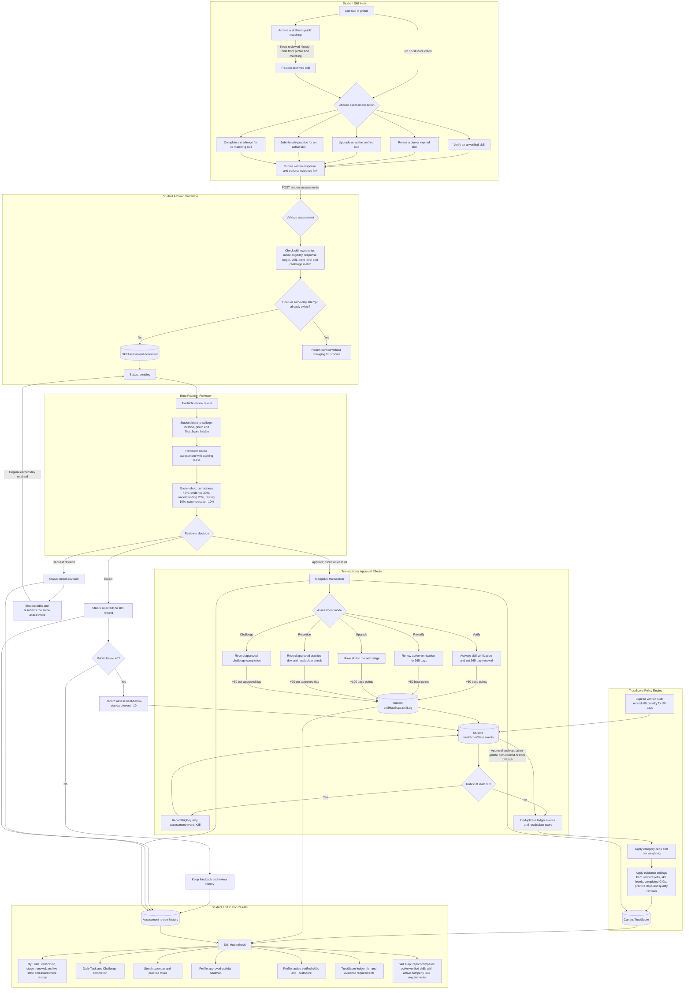
```mermaid
flowchart TD
    subgraph StudentActions[Student Skill Hub]
        Add[Add skill to profile]
        Archive[Archive a skill from public matching]
        Restore[Restore archived skill]
        Select{Choose assessment action}
        Verify[Verify an unverified skill]
        Reverify[Renew a due or expired skill]
        Upgrade[Upgrade an active verified skill]
        Retain[Submit daily practice for an active skill]
        Challenge[Complete a challenge for its matching skill]
        Evidence[Submit written response and optional evidence link]

        Add -->|No TrustScore credit| Select
        Add --> Archive
        Archive -->|Keep reviewed history; hide from profile and matching| Restore
        Restore --> Select
        Select --> Verify
        Select --> Reverify
        Select --> Upgrade
        Select --> Retain
        Select --> Challenge
        Verify --> Evidence
        Reverify --> Evidence
        Upgrade --> Evidence
        Retain --> Evidence
        Challenge --> Evidence
    end

    subgraph SubmissionAPI[Student API and Validation]
        Validate{Validate assessment}
        Rules[Check skill ownership, mode eligibility, response length, URL, next level and challenge match]
        Duplicate{Open or same-day attempt already exists?}
        Assessment[(SkillAssessment document)]
        Pending[Status: pending]

        Validate --> Rules --> Duplicate
        Duplicate -->|Yes| Conflict[Return conflict without changing TrustScore]
        Duplicate -->|No| Assessment --> Pending
    end

    Evidence -->|POST student assessments| Validate

    subgraph ReviewerPipeline[Blind Platform Reviewer]
        Queue[Available review queue]
        Blind[Student identity, college, location, photo and TrustScore hidden]
        Claim[Reviewer claims assessment with expiring lease]
        Rubric[Score rubric: correctness 40%, evidence 20%, understanding 20%, testing 10%, communication 10%]
        Decision{Reviewer decision}

        Queue --> Blind --> Claim --> Rubric --> Decision
    end

    Pending --> Queue

    Decision -->|Request revision| Revision[Status: needs revision]
    Revision --> Resubmit[Student edits and resubmits the same assessment]
    Resubmit -->|Original earned day retained| Pending

    Decision -->|Reject| Rejected[Status: rejected; no skill reward]
    Rejected --> LowScore{Rubric below 40?}
    LowScore -->|Yes| Penalty[Record assessment-below-standard event: -10]
    LowScore -->|No| AuditOnly[Keep feedback and review history]

    Decision -->|Approve; rubric at least 70| Transaction[MongoDB transaction]

    subgraph ApprovalEffects[Transactional Approval Effects]
        ModeEvent{Assessment mode}
        Verified[Activate skill verification and set 365-day renewal]
        Renewed[Renew active verification for 365 days]
        Upgraded[Move skill to the next stage]
        Practiced[Record approved practice day and recalculate streak]
        Challenged[Record approved challenge completion]
        SkillLog[(Student skillHubState.skillLog)]
        Ledger[(Student trustScoreState.events)]
        Quality{Rubric at least 90?}
        QualityCredit[Record high-quality assessment event: +25]

        Transaction --> ModeEvent
        ModeEvent -->|Verify| Verified
        ModeEvent -->|Reverify| Renewed
        ModeEvent -->|Upgrade| Upgraded
        ModeEvent -->|Retention| Practiced
        ModeEvent -->|Challenge| Challenged
        Verified -->|+60 base points| SkillLog
        Renewed -->|+50 base points| SkillLog
        Upgraded -->|+100 base points| SkillLog
        Practiced -->|+20 per approved day| SkillLog
        Challenged -->|+80 per approved day| SkillLog
        SkillLog --> Ledger
        Ledger --> Quality
        Quality -->|Yes| QualityCredit --> Ledger
        Quality -->|No| Recalculate
    end

    Penalty --> Ledger
    AuditOnly --> ReviewHistory[(Assessment review history)]
    Revision --> ReviewHistory
    Rejected --> ReviewHistory
    Transaction --> ReviewHistory

    subgraph TrustPolicy[TrustScore Policy Engine]
        Recalculate[Deduplicate ledger events and recalculate score]
        Caps[Apply category caps and tier weighting]
        Gates[Apply evidence ceilings from verified skills, skill levels, completed GIGs, practice days and quality reviews]
        Expiry[Expired verified skill: record -80 penalty for 90 days]
        Score[(Current TrustScore)]

        Ledger --> Recalculate
        Expiry --> Ledger
        Recalculate --> Caps --> Gates --> Score
    end

    subgraph StudentResults[Student and Public Results]
        Hub[Skill Hub refresh]
        Skills[My Skills: verification, stage, renewal, archive state and assessment history]
        Daily[Daily Task and Challenge completion]
        Streak[Streak calendar and practice totals]
        Heatmap[Profile approved-activity heatmap]
        Profile[Profile: active verified skills and TrustScore]
        TrustPage[TrustScore ledger, tier and evidence requirements]
        Gap[Skill Gap Report compares active verified skills with active company GIG requirements]

        Score --> Hub
        SkillLog --> Hub
        ReviewHistory --> Hub
        Hub --> Skills
        Hub --> Daily
        Hub --> Streak
        Hub --> Heatmap
        Hub --> Profile
        Hub --> TrustPage
        Hub --> Gap
    end

    Transaction -->|Approval and reputation update both commit or both roll back| Score
```

> ⚡ **Quick flow:** Student submits skill evidence → reviewer claims and scores it → approved result updates skill status, activity, and TrustScore → verified evidence appears across the profile and platform. Students can archive a skill to remove it from public matching while retaining its reviewed history.

## 📁 Folder Structure

```text
skillbridge/
├── .github/
│   └── workflows/ci.yml            # Lint, build and server test pipeline
├── client/                         # React 19 + Vite frontend
│   ├── public/                     # Static browser assets
│   ├── src/
│   │   ├── assets/                 # Runtime video assets
│   │   ├── auth/                   # Shared login portal
│   │   ├── company/                # Company dashboard and workflows
│   │   ├── config/                 # Frontend runtime configuration
│   │   ├── landing/                # Public landing experience
│   │   ├── lib/                    # API, URL and formatting helpers
│   │   ├── reviewer/               # Reviewer auth and assessment queue
│   │   ├── student/                # Student dashboard and workflows
│   │   │   ├── earning/            # Earnings read model
│   │   │   ├── gig/                # GIG discovery and applications
│   │   │   ├── network/            # Connections and Team-Up
│   │   │   ├── skillhub/           # Skills, practice, streak and gap report
│   │   │   └── task/               # Interview and assessment submissions
│   │   ├── ui/                     # Shared profile, loading and toast UI
│   │   ├── App.jsx                 # Routes and protected workspaces
│   │   └── main.jsx                # Browser entry point
│   ├── package.json                # Frontend dependencies and commands
│   ├── vercel.json                 # SPA deployment rewrite
│   └── vite.config.js              # Vite configuration
├── server/                         # Node.js API and MongoDB persistence
│   ├── config/                     # Environment, policies and default state
│   ├── controllers/                # Domain and request handlers
│   ├── models/                     # Eight Mongoose collection schemas
│   ├── scripts/                    # Reviewer, seed and reconciliation tools
│   ├── tests/                      # Backend unit and workflow tests
│   ├── utils/                      # Auth, validation, policy and logging helpers
│   ├── package.json                # Backend dependencies and commands
│   └── server.js                   # Native HTTP router and server entry
├── docs/                           # Documentation
│   ├── assets/
│   │   └── screenshots/            # README product screenshots
│   ├── assessment-operations.md    # Reviewer workflow notes
│   ├── gig-pipeline-verification.md
│   ├── landing-page.md
│   └── trustscore-v2.md
├── render.yaml                     # Render backend deployment
└── README.md
```

## 🗄️ Database Design

### 1. 🧩 Persistence Model

SkillBridge uses MongoDB through Mongoose. Account-owned state is embedded in the relevant student or company document, while records that have an independent lifecycle, concurrent actors, or audit requirements use dedicated collections.

#### Current Collections

| Collection | Owner / References | Purpose |
| --- | --- | --- |
| `students` | Student account | Identity, profile, portfolio, Skill Hub state, verified skills, TrustScore event ledger, GIG state, sessions, and usage data. |
| `companies` | Company account | Business profile, GIG management, task library, private review guides, project workspace, sessions, and usage data. |
| `reviewers` | Reviewer account | Reviewer/admin identity, active status, authentication sessions, and last sign-in time. |
| `skillassessments` | References `Student`; optionally `Reviewer` | Verification, re-verification, upgrade, retention, and challenge submissions with evidence, rubric scores, feedback, claim ownership, and review history. |
| `tasksubmissions` | References `Student` and `Company` | Stable record shared by the interview, selection, workspace, delivery, approval, external-payment, completion, and TrustScore pipeline. |
| `networkconnections` | References requester and recipient `Student` | One normalized relationship per student pair with pending, accepted, or declined status. |
| `teamposts` | References owner and participating `Student` records | Collaboration posts, required skills, available slots, applications/invitations, and membership decisions. |
| `sitemetrics` | Platform-owned | Atomic counters such as site views, keyed by metric name. |

### 2. 🗺️ Entity Relationship Diagram (ERD)

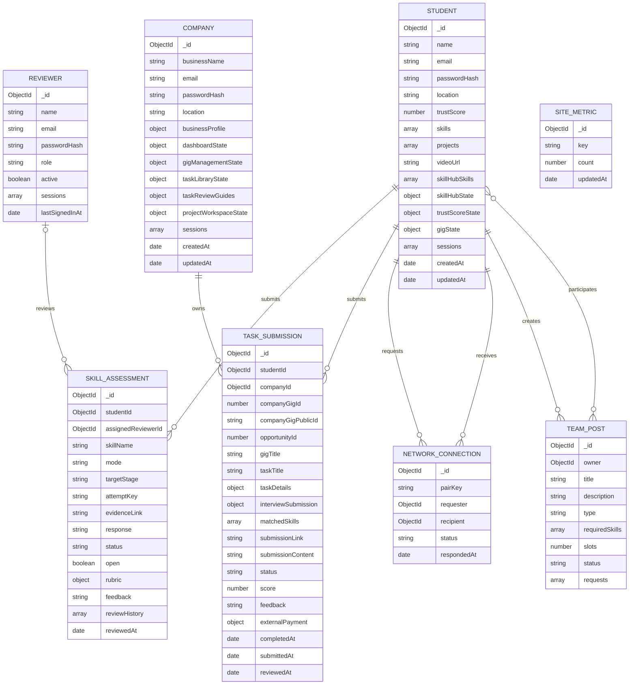
```mermaid
erDiagram
    STUDENT ||--o{ SKILL_ASSESSMENT : submits
    REVIEWER o|--o{ SKILL_ASSESSMENT : reviews
    STUDENT ||--o{ TASK_SUBMISSION : submits
    COMPANY ||--o{ TASK_SUBMISSION : owns
    STUDENT ||--o{ NETWORK_CONNECTION : requests
    STUDENT ||--o{ NETWORK_CONNECTION : receives
    STUDENT ||--o{ TEAM_POST : creates
    STUDENT }o--o{ TEAM_POST : participates

    STUDENT {
        ObjectId _id
        string name
        string email
        string passwordHash
        string location
        number trustScore
        array skills
        array projects
        string videoUrl
        array skillHubSkills
        object skillHubState
        object trustScoreState
        object gigState
        array sessions
        date createdAt
        date updatedAt
    }

    COMPANY {
        ObjectId _id
        string businessName
        string email
        string passwordHash
        string location
        object businessProfile
        object dashboardState
        object gigManagementState
        object taskLibraryState
        object taskReviewGuides
        object projectWorkspaceState
        array sessions
        date createdAt
        date updatedAt
    }

    REVIEWER {
        ObjectId _id
        string name
        string email
        string passwordHash
        string role
        boolean active
        array sessions
        date lastSignedInAt
    }

    SKILL_ASSESSMENT {
        ObjectId _id
        ObjectId studentId
        ObjectId assignedReviewerId
        string skillName
        string mode
        string targetStage
        string attemptKey
        string evidenceLink
        string response
        string status
        boolean open
        object rubric
        string feedback
        array reviewHistory
        date reviewedAt
    }

    TASK_SUBMISSION {
        ObjectId _id
        ObjectId studentId
        ObjectId companyId
        number companyGigId
        string companyGigPublicId
        number opportunityId
        string gigTitle
        string taskTitle
        object taskDetails
        object interviewSubmission
        array matchedSkills
        string submissionLink
        string submissionContent
        string status
        number score
        string feedback
        object externalPayment
        date completedAt
        date submittedAt
        date reviewedAt
    }

    NETWORK_CONNECTION {
        ObjectId _id
        string pairKey
        ObjectId requester
        ObjectId recipient
        string status
        date respondedAt
    }

    TEAM_POST {
        ObjectId _id
        ObjectId owner
        string title
        string description
        string type
        array requiredSkills
        number slots
        string status
        array requests
    }

    SITE_METRIC {
        ObjectId _id
        string key
        number count
        date updatedAt
    }
```

### 3. 🧠 Embedded State and Derived Views

| Data | Source of truth | How it is used |
| --- | --- | --- |
| Student profile and portfolio | `students` | Public profile responses expose a sanitized projection rather than copying data into another collection. |
| Verified skill level and renewal status | `students.skillHubSkills` | Updated only after reviewer-approved assessment outcomes and displayed in Skill Hub, Network, GIG matching, and the public profile. |
| Skill activity, streak, and gap snapshot | `students.skillHubState` | Activity is built from approved events; the gap report compares verified skills with active company GIG requirements. |
| TrustScore | `students.trustScoreState.events` | The event ledger is authoritative; `students.trustScore` is the materialized total used for fast sorting and display. |
| GIG definition and applicant pipeline | `companies.gigManagementState` | Drives opportunity discovery, applications, company review, and selection. |
| Interview and delivery lifecycle | `tasksubmissions` | Connects the student, company, GIG, task, workspace, revision, approval, payment, and completion stages. |
| Earnings and payment history | `tasksubmissions.externalPayment` | Student earnings and company payment screens are derived from externally paid submissions; SkillBridge stores no wallet, escrow, or withdrawable balance. |
| Network cards and team-up views | `students`, `networkconnections`, `teamposts` | API responses join current profile/skill data with relationship and collaboration records. |

### 4. 🛡️ Integrity and Concurrency Controls

- Unique account identifiers prevent duplicate logins within each student, company, and reviewer account collection.
- Partial unique indexes allow only one open Skill Hub assessment per student attempt, while queue indexes support reviewer claims and history lookup.
- A normalized unique `pairKey` prevents duplicate network relationships between the same two students.
- A compound unique index prevents duplicate task submissions for the same student, company, GIG, and opportunity.
- External transaction references are unique per company, making payment recording idempotent and auditable.
- Optimistic concurrency protects student TrustScore/Skill Hub updates, assessment reviews, task submissions, and team-post decisions from silent overwrite.
- MongoDB transactions couple approved assessment or payment changes with their related TrustScore event, so cross-document updates succeed or fail together.

## 🖼️ Product Screens

### 🌿 Landing page

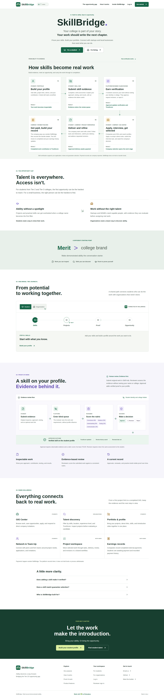

The primary authenticated workspaces are shown below at a consistent desktop viewport.

### 🎓 Student workspace

| GIG Center | TrustScore |
| --- | --- |
| 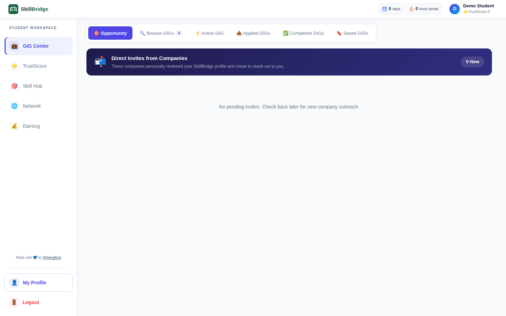 | 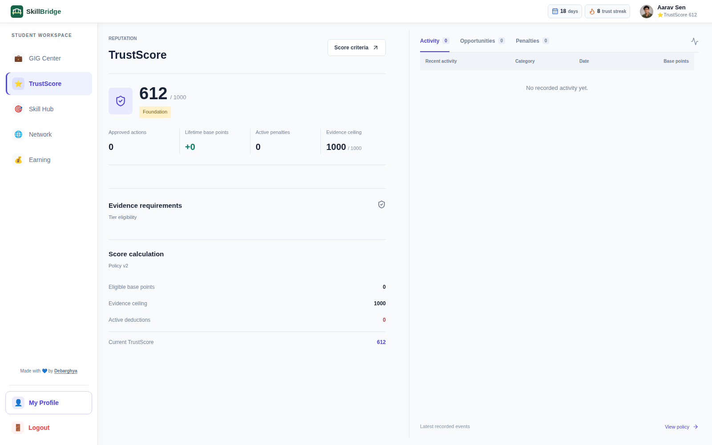 |
| **Skill Hub**<br>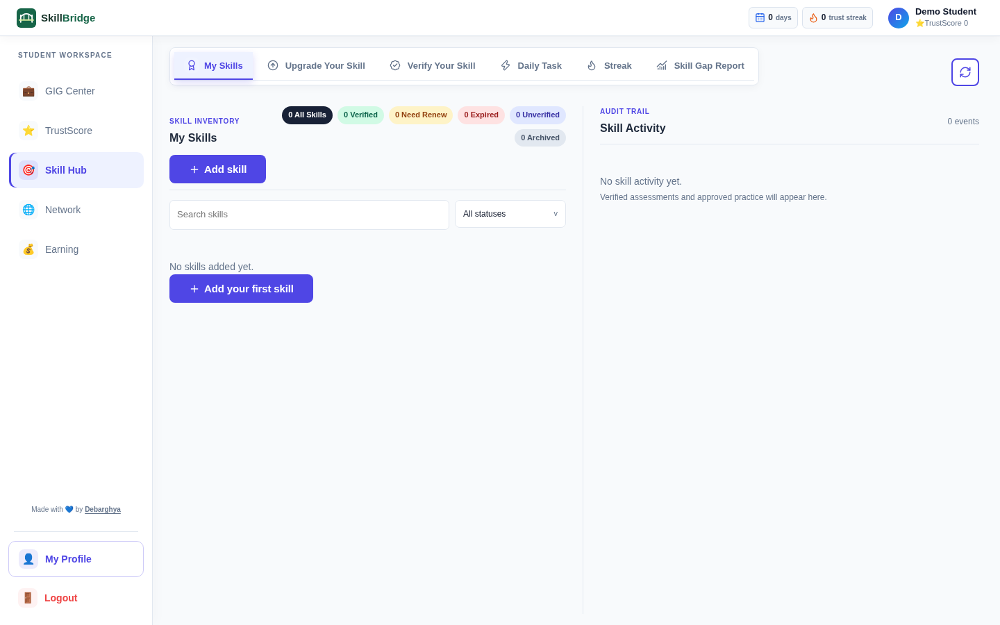 | **Network**<br>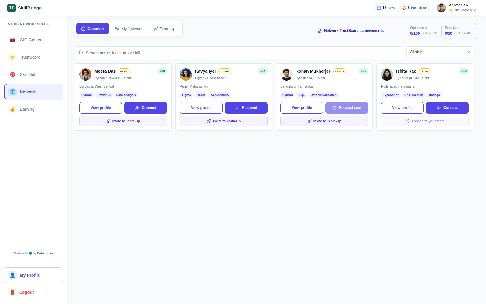 |
| **Earning**<br>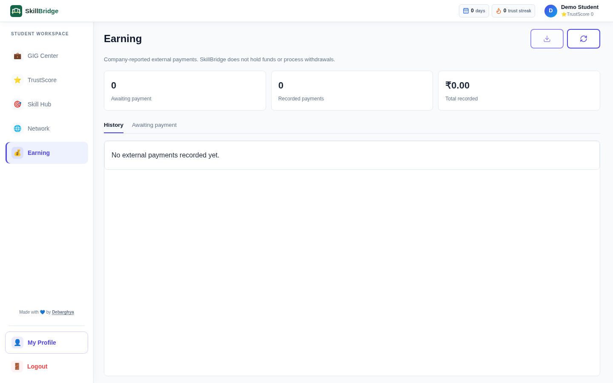 | **My Profile**<br>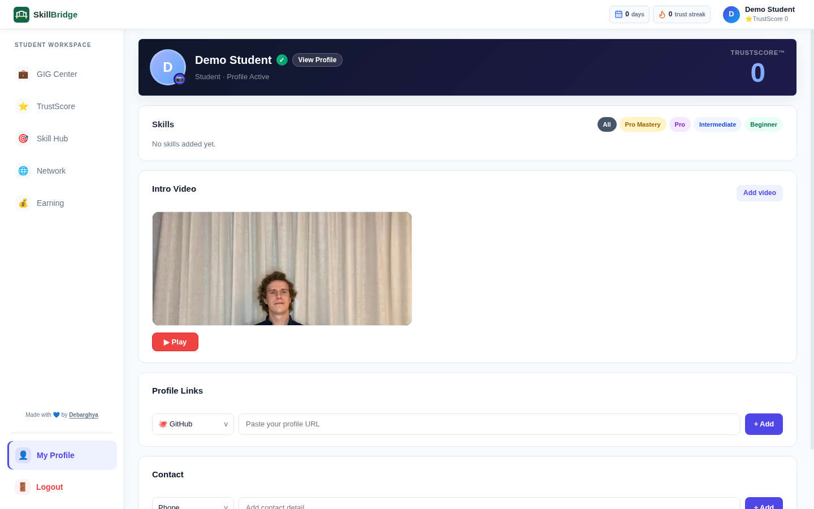 |
| **Task page**<br>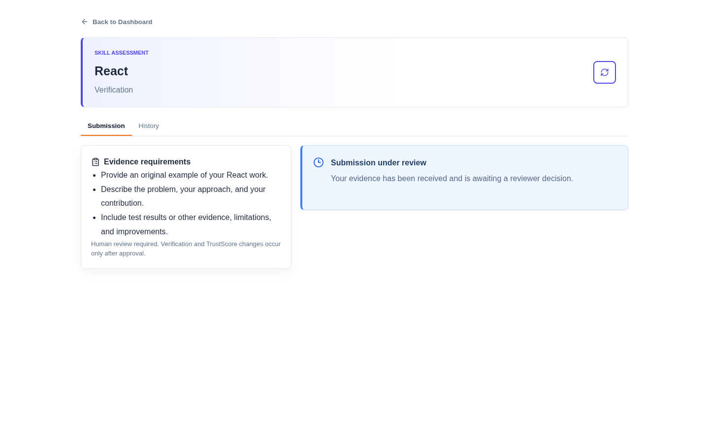 | |

### 🏢 Company workspace

| My Business | GIG Management |
| --- | --- |
| 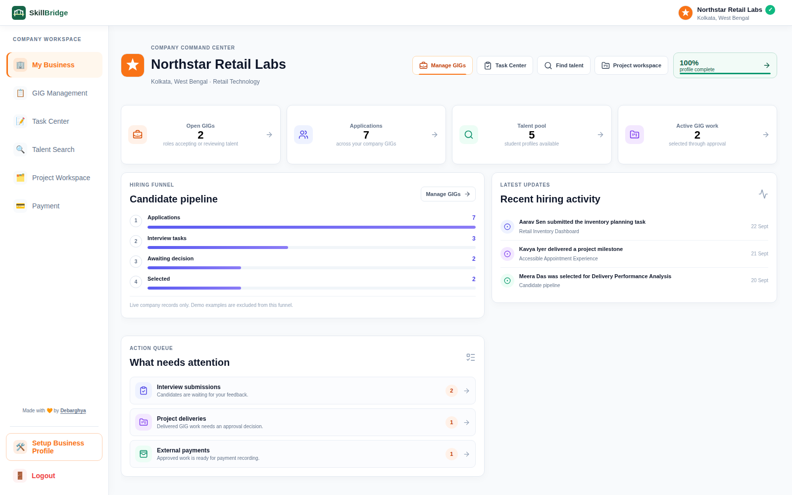 | 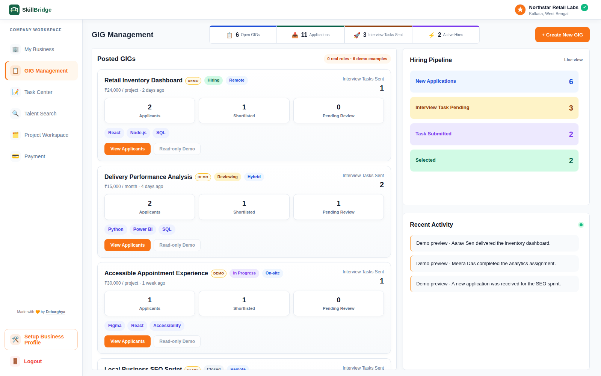 |
| **Task Center**<br>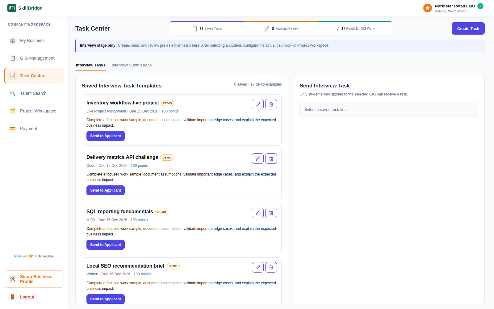 | **Talent Search**<br>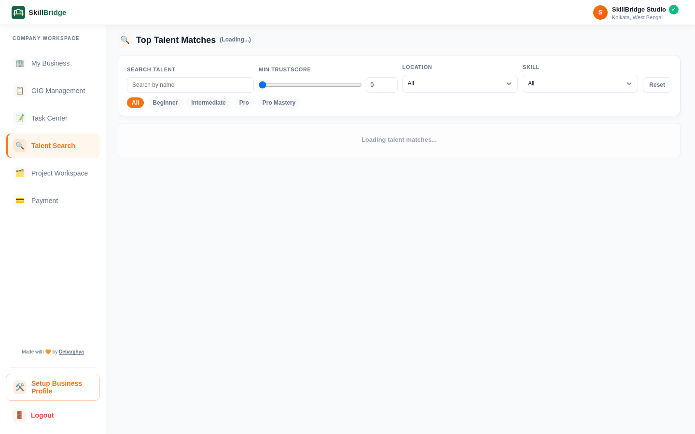 |
| **Project Workspace**<br>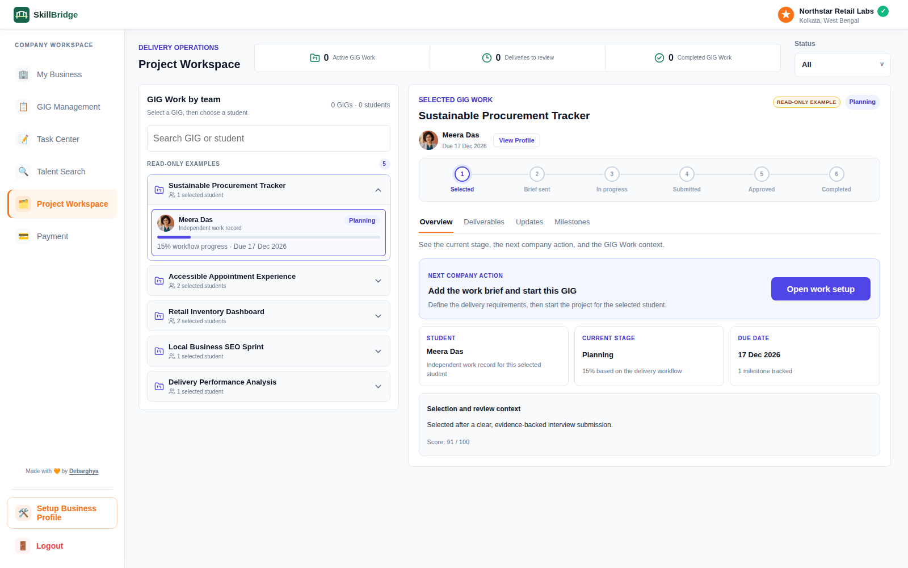 | **Payment**<br>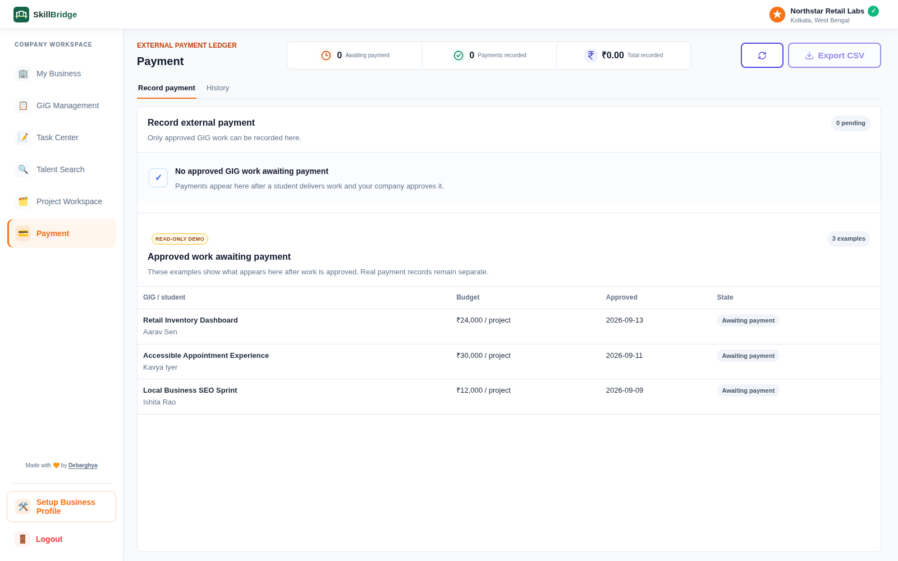 |
| **Business Profile**<br>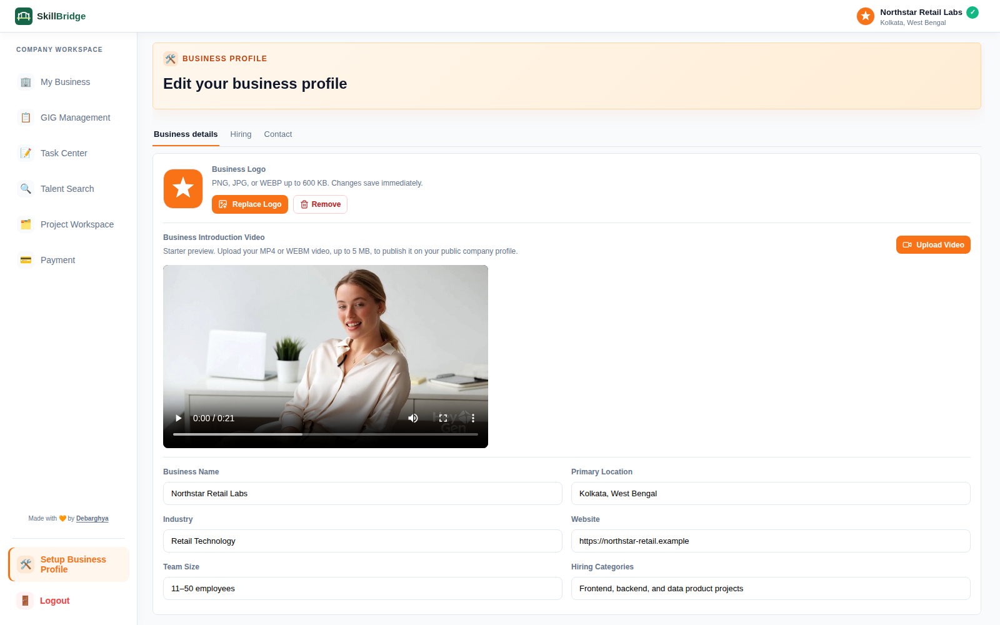 | |

### 🧾 Reviewer workspace

| Review queue |
| --- |
| 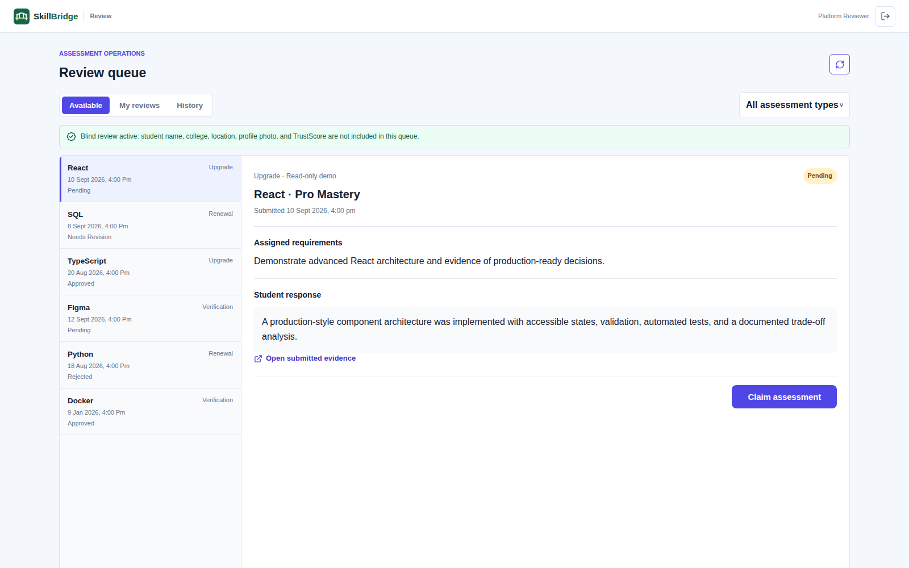 |

## 🧰 Tech Stack

| Area | Technology |
| --- | --- |
| Client | React 19, React Router 7, Vite 8, CSS, Lucide icons |
| API | Node.js 22, native HTTP server, REST-style JSON |
| Data | MongoDB, Mongoose 9 |
| Authentication | Role-scoped bearer sessions and password hashing with Node.js crypto |
| Reliability | Schema validation, optimistic concurrency, transactions, unique indexes, rate limits |
| Testing | Node.js test runner, integration scripts, ESLint, Vite production build |
| Delivery | Vercel frontend, Render backend, GitHub Actions CI |

## ⚙️ Local Setup

### 📋 Prerequisites

- Node.js 22 or newer
- npm
- A local or hosted MongoDB deployment

### 1. 📦 Clone and install

```bash
git clone https://github.com/debarghya131/SkillBridge.git
cd SkillBridge
cd server && npm ci
cd ../client && npm ci
```

### 2. 🔧 Configure the API

```bash
cd server
cp .env.example .env
```

Set a valid `MONGO_URL` in `server/.env`. The provided defaults are suitable for a local frontend on `http://localhost:5173`.

### 3. ▶️ Start both applications

Terminal 1:

```bash
cd server
npm run dev
```

Terminal 2:

```bash
cd client
npm run dev
```

| Service | Local URL |
| --- | --- |
| Web app | `http://localhost:5173` |
| API | `http://localhost:5000` |
| API readiness | `http://localhost:5000/ready` |

## 🔐 Configuration

### 🖥️ Server: `server/.env`

| Variable | Default | Purpose |
| --- | --- | --- |
| `NODE_ENV` | `development` | Runtime mode |
| `MONGO_URL` | required | MongoDB connection string |
| `DB_MAX_POOL_SIZE` | `20` | Maximum MongoDB connections per API instance |
| `DB_MIN_POOL_SIZE` | `0` | Warm MongoDB connections retained per API instance |
| `DB_MAX_IDLE_TIME_MS` | `30000` | Idle MongoDB connection lifetime |
| `DB_SERVER_SELECTION_TIMEOUT_MS` | `10000` | MongoDB server-selection timeout |
| `VERIFICATION_HASH_SECRET` | required in production | 32+ character secret used to HMAC identity/business verification references |
| `PORT` | `5000` | API port |
| `CORS_ORIGIN` | `http://localhost:5173` | Allowed client origin |
| `SESSION_TTL_DAYS` | `30` | Session lifetime |
| `MAX_SESSIONS_PER_ACCOUNT` | `5` | Concurrent session limit |
| `REVIEW_CLAIM_TTL_MINUTES` | `240` | Reviewer claim lease duration |
| `MAX_REQUEST_BODY_BYTES` | `8000000` | Maximum JSON request size |
| `RATE_LIMIT_WINDOW_MS` | `60000` | General rate-limit window |
| `RATE_LIMIT_MAX_REQUESTS` | `120` | General requests per window |
| `AUTH_RATE_LIMIT_MAX_REQUESTS` | `12` | Authentication requests per window |
| `DAILY_USER_RATE_LIMIT_MAX_REQUESTS` | `2000` | Authenticated requests per user per day |
| `DAILY_SECTION_OPERATION_LIMIT` | `2` | Limited writes per section per day |
| `RATE_LIMITING_ENABLED` | `true` | Set to `false` only for controlled local testing |
| `LOG_LEVEL` | `info` | Server log threshold |

### 🌐 Client: `client/.env`

```env
VITE_API_URL=http://localhost:5000
```

`VITE_API_URL` must point to the deployed Render API in production. The API's `CORS_ORIGIN` must contain the corresponding Vercel/custom frontend origin.

### MongoDB Operations

Production disables Mongoose automatic index creation. Run the database commands from `server/` against staging first, then production after a backup:

```bash
# Read-only: inspect document sizes, inline media, and index storage.
npm run db:audit

# Read-only: report existing indexes and explicitly managed redundant indexes.
npm run db:indexes

# Create declared indexes without removing custom indexes.
npm run db:indexes -- --apply

# After reviewing the dry run, remove only known redundant standalone indexes.
npm run db:indexes -- --apply --drop-redundant

# Find legacy raw verification references, then replace them with HMAC fingerprints.
npm run db:migrate-verification
npm run db:migrate-verification -- --apply
```

The migration never prints raw identity or registration values. Keep existing inline images/videos until they are moved to object storage; the audit reports every affected document so that migration can be planned without deleting user content.

## 🧪 Quality Checks

```bash
cd server
npm run check
npm test

cd ../client
npm run lint
npm run build
```

GitHub Actions runs backend syntax checks and tests plus the production client build on every push and pull request.

## 🚧 Challenges Faced

- Keeping student, company, and reviewer actions consistent across one work lifecycle.
- Turning evidence and practical work into a fair, non-duplicated TrustScore signal.
- Managing responsive dashboards with dense operational workflows.

## ✅ Solutions Implemented

- Centralized the GIG, task, review, payment, and completion lifecycle in persistent backend records.
- Used reviewer rubrics, transactions, unique indexes, and an event ledger to protect skill and TrustScore updates.
- Built role-specific, responsive workspaces with shared API helpers and validation.

## 🔮 Future Improvements

- Add notifications for invitations, review outcomes, milestones, and recorded payments.
- Add browser-level end-to-end tests and admin observability.
- Add managed media uploads and payment-proof/dispute records.

## 📚 Learnings

- Designing a two-sided marketplace requires explicit ownership and status transitions.
- A reputation system needs auditable events, not client-side counters.
- Focused domain modules make a large React and Node.js application easier to evolve.

## 👤 Author Details

<!-- markdownlint-disable MD033 -->

<!-- markdownlint-enable MD033 -->

### Debarghya Bandyopadhyay

### 🤝 Be My Friend

I always like to make new friends. Follow me on:

[](https://portfolio.debarghya.org)
[](https://www.linkedin.com/in/debarghya131)
[](https://leetcode.com/u/debarghya131/)
[](https://x.com/debarghya131)
[](mailto:debarghyabandyopadhyay191@gmail.com)
[](https://github.com/debarghya131)

Email: [debarghyabandyopadhyay191@gmail.com](mailto:debarghyabandyopadhyay191@gmail.com)
